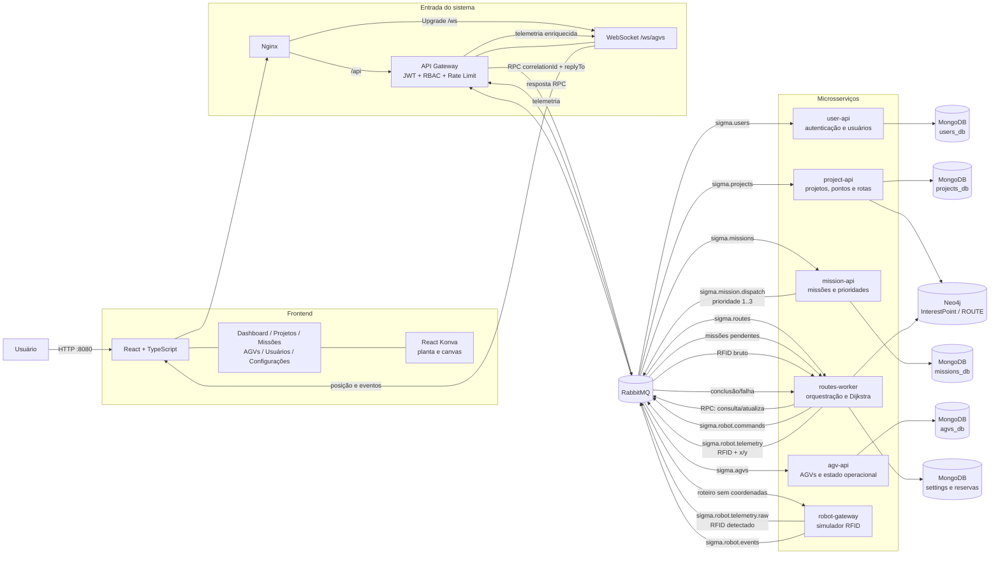
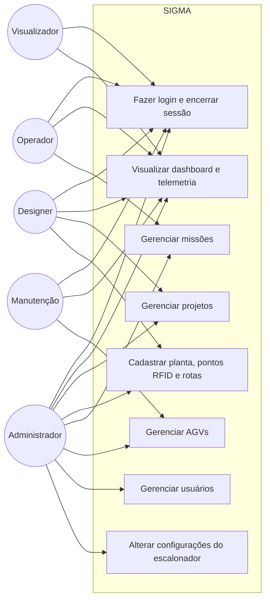
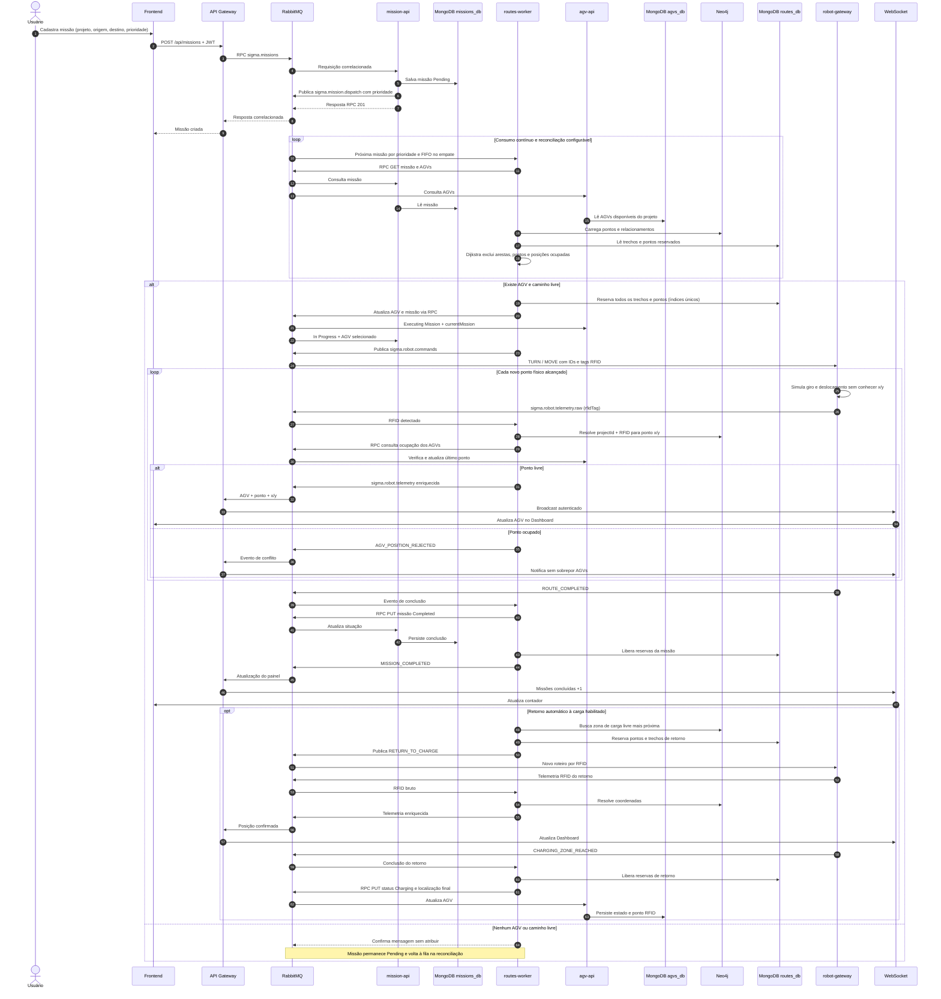
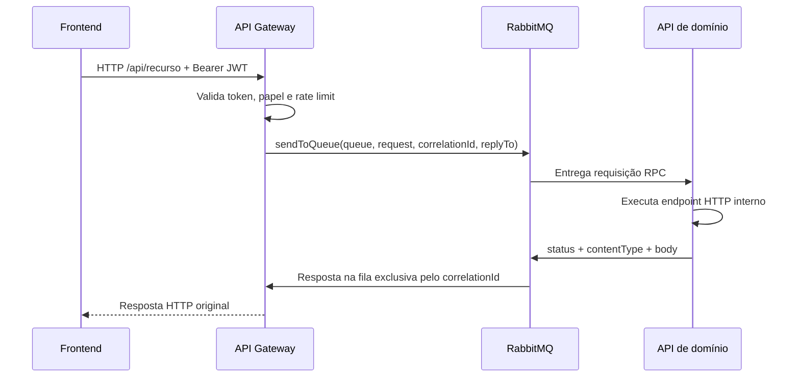

# SIGMA

Sistema Integrado de Gerenciamento e Monitoramento de AGVs. A aplicação cadastra projetos e plantas baixas, modela pontos de interesse (com tags RFID) e rotas em grafo, prioriza missões, seleciona AGVs, evita colisões e acompanha a posição confirmada dos robôs em tempo real.

## Arquitetura



### Responsabilidades

| Componente    | Responsabilidade                                                                                                              |
| ------------- | ----------------------------------------------------------------------------------------------------------------------------- |
| Frontend      | Interface administrativa, editor da planta, dashboard e cliente WebSocket.                                                    |
| Nginx         | Serve a SPA e encaminha HTTP e WebSocket ao API Gateway.                                                                      |
| API Gateway   | Autentica JWT, aplica permissões, converte HTTP em RPC RabbitMQ e transmite telemetria por WebSocket.                        |
| user-api      | Login e CRUD de usuários.                                                                                                    |
| project-api   | Metadados da planta no MongoDB; pontos RFID e relacionamentos`ROUTE` no Neo4j.                                              |
| mission-api   | CRUD de missões e publicação na fila prioritária.                                                                         |
| agv-api       | Cadastro, vínculo com projeto, bateria, estado, missão e último ponto RFID do AGV.                                         |
| routes-worker | Escalonamento, seleção do AGV, cálculo do caminho, reservas, prevenção de colisões, resolução RFID e configurações por filas. |
| robot-gateway | Simula o protocolo do robô: recebe roteiro, executa giros/deslocamentos e reporta apenas RFID.                               |

## Casos de uso por perfil de usuário



| Perfil | Permissões na interface |
| --- | --- |
| Administrador | Acesso total a projetos, pontos e rotas, missões, AGVs, usuários e configurações. |
| Operador | Acompanhamento do dashboard e CRUD de missões. |
| Designer | Acompanhamento do dashboard e CRUD de projetos, plantas, pontos RFID e rotas. |
| Manutenção | Acompanhamento do dashboard e CRUD de AGVs. |
| Visualizador | Acesso somente ao dashboard e à telemetria em tempo real. |

As permissões de escrita também são validadas pelo API Gateway a partir da role presente no token JWT; ocultar uma opção no frontend não substitui a autorização no backend.

## Sequência completa de uma missão



## Fluxo RPC HTTP



## Persistência

- `users_db`: usuários, credenciais com hash e perfil de acesso.
- `projects_db`: nome, descrição, imagem da planta e dimensões do canvas.
- `missions_db`: projeto, origem, destino, prioridade, situação e AGV atribuído.
- `agvs_db`: projeto, identificação, bateria, estado, missão e último ponto RFID.
- `routes_db`: configurações globais, reservas exclusivas de arestas e pontos.
- Neo4j: nós `InterestPoint` com RFID, tipo, direções e coordenadas; relacionamentos `ROUTE`.
- RabbitMQ: mensagens RPC, fila prioritária, comandos do robô, eventos e telemetria.

## Filas RabbitMQ

| Fila                          | Produtor principal          | Consumidor principal      |
| ----------------------------- | --------------------------- | ------------------------- |
| `sigma.users`               | API Gateway / routes-worker | user-api                  |
| `sigma.projects`            | API Gateway                 | project-api               |
| `sigma.missions`            | API Gateway / routes-worker | mission-api               |
| `sigma.agvs`                | API Gateway / routes-worker | agv-api                   |
| `sigma.routes`              | API Gateway                 | routes-worker             |
| `sigma.mission.dispatch`    | reconciliador               | routes-worker             |
| `sigma.robot.commands`      | routes-worker               | robot-gateway             |
| `sigma.robot.telemetry.raw` | robot-gateway               | routes-worker             |
| `sigma.robot.events`        | robot-gateway               | routes-worker             |
| `sigma.robot.telemetry`     | routes-worker               | API Gateway               |

## Execução com Docker

Com o Docker Desktop em execução:

```bash
docker compose up --build
```

Serviços expostos no host:

- Frontend: [http://localhost:8080](http://localhost:8080)
- API Gateway: [http://localhost:3000](http://localhost:3000)
- RabbitMQ Management: [http://localhost:15672](http://localhost:15672) (`sigma` / `sigma_rabbit_password`)
- Neo4j Browser: [http://localhost:7474](http://localhost:7474) (`neo4j` / `sigma_password`)

Credenciais iniciais da aplicação:

- E-mail: `admin@sigma.local`
- Senha: `Sigma@123`

O administrador inicial é criado somente quando ainda não existe. Altere `ADMIN_EMAIL`, `ADMIN_PASSWORD`, credenciais dos bancos e `JWT_SECRET` antes de usar o sistema fora do ambiente local.

Para encerrar sem apagar os dados:

```bash
docker compose down
```

Para encerrar e remover os volumes persistentes:

```bash
docker compose down -v
```

> Atenção: `docker compose down -v` remove permanentemente os dados do MongoDB, Neo4j e RabbitMQ.

## Portas internas

| Serviço      | Porta |
| ------------- | ----: |
| API Gateway   |  3000 |
| user-api      |  3001 |
| project-api   |  3002 |
| mission-api   |  3003 |
| agv-api       |  3004 |
| robot-gateway |  3006 |

As APIs de domínio não são publicadas no host. Todo acesso da interface passa pelo Nginx e pelo API Gateway.
